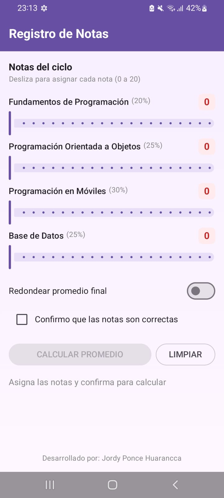
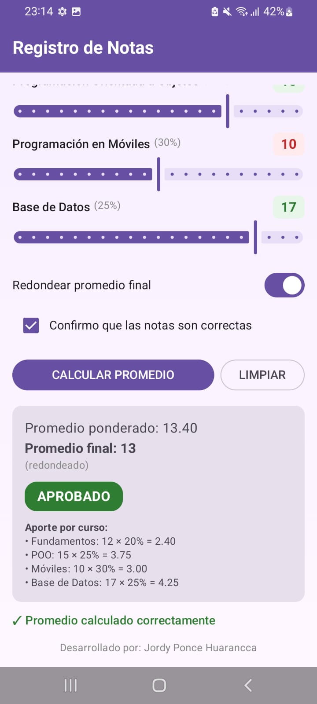

# Lab03: Registro de Notas 🎓

Aplicación móvil en Android desarrollada con Jetpack Compose para calcular el promedio ponderado de cuatro asignaturas, con opción de redondeo y estado de observación según reglas de negocio.

## 📱 Capturas de pantalla

### 1. Formulario de registro

### 2. Resultado del promedio
