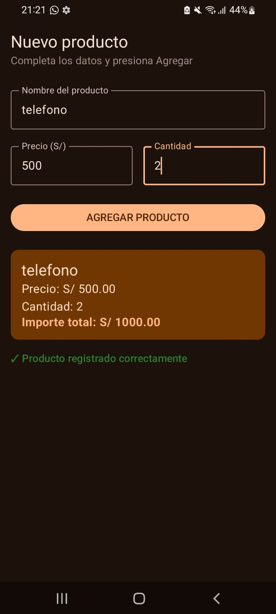

# Lab 03: Registro de Producto

Estudiante: Jordy Ponce Huarancca
Curso: Desarrollo de Aplicaciones Móviles

## Descripción
Aplicación desarrollada en Android Studio con Jetpack Compose para el registro de productos. Permite ingresar nombre, precio y cantidad, calculando dinámicamente el importe total mediante gestión de estado (`remember` y `mutableStateOf`).

## Capturas de Pantalla

### 1. Pantalla Inicial

### 2. Producto Registrado

---

## Pregunta de Reflexión

¿Qué pasaría si declaras las variables de los campos SIN `remember`?**

Respuesta:
Si se declaran las variables de estado sin utilizar `remember`, el valor de la variable se reiniciará a su estado inicial (`""`) en cada recomposición (cada vez que la pantalla se redibuja al escribir un carácter). Por lo tanto, el usuario no podrá ver lo que escribe en los campos de texto porque el estado se borrará instantáneamente. `remember` es indispensable para preservar el valor de la variable a lo largo del ciclo de vida del composable.