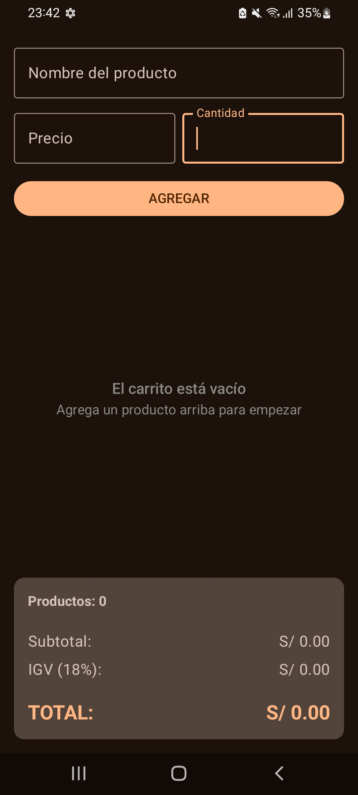
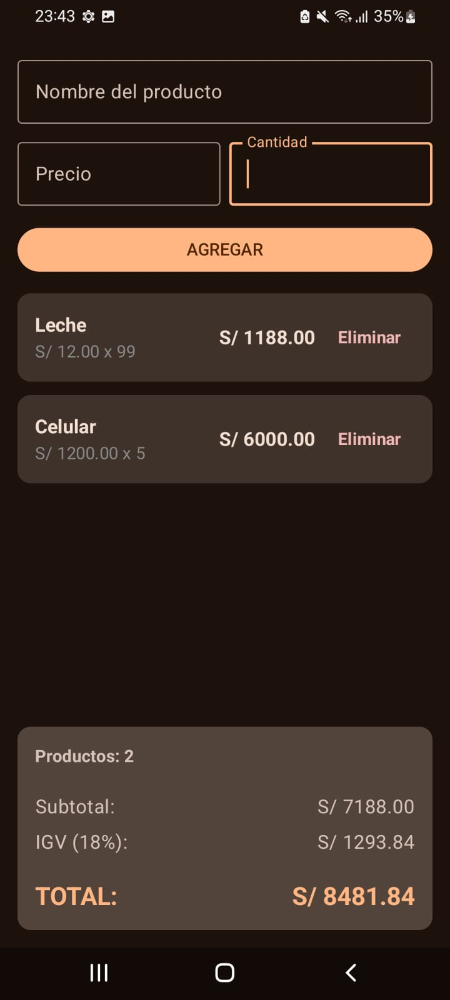

# Lab 04: Carrito de Compras en Jetpack Compose

Estudiante: Ponce Huarancca Jordy 
Curso: Móviles - Android  
Sección: D

## Descripción del Proyecto
Aplicación Android desarrollada con **Jetpack Compose** que simula un carrito de compras. Permite ingresar productos con precio y cantidad, visualizarlos en una lista scrollable (`LazyColumn`), eliminar elementos individuales, manejar un estado vacío cuando la lista no tiene elementos y calcular dinámicamente el Subtotal, IGV (18%) e Importe Total.

---

## Capturas de Pantalla

| Estado Vacío | Con Productos |
|:---:|:---:|
|  |  |

*(Nota: Guarda las capturas de tu emulador en la raíz del proyecto con los nombres `captura_vacio.png` y `captura_lleno.png`)*

---

## Respuestas Conceptuales

### (a) ¿Por qué `mutableStateListOf` y no una `MutableList` normal?
Porque `mutableStateListOf` es una colección **observable** por el sistema de estado de Jetpack Compose. Cuando agregamos o eliminamos un elemento de `mutableStateListOf`, Compose detecta el cambio automáticamente y provoca una **recomposición** de la interfaz. Si usáramos una `MutableList` estándar, los datos cambiarían internamente pero la pantalla no se actualizaría de forma visual.

### (b) ¿Por qué la lista es `val`?
Porque la referencia/puntero a la instancia del objeto `SnapshotStateList` que crea `mutableStateListOf()` no necesita ni debe cambiar. Lo que se modifica es el **contenido interno** de la lista (se añaden o remueven elementos), no la variable que sostiene la referencia. Usar `val` garantiza inmutabilidad en la referencia.

### (c) ¿Qué hace `weight(1f)` en la `LazyColumn`?
El modificador `weight(1f)` dentro de un contenedor `Column` hace que la `LazyColumn` tome todo el espacio vertical disponible que sobre en la pantalla. De esta manera, la lista puede crecer o tener desplazamientos sin empujar el panel de totales fuera de la pantalla, manteniendo los totales fijos en la parte inferior.